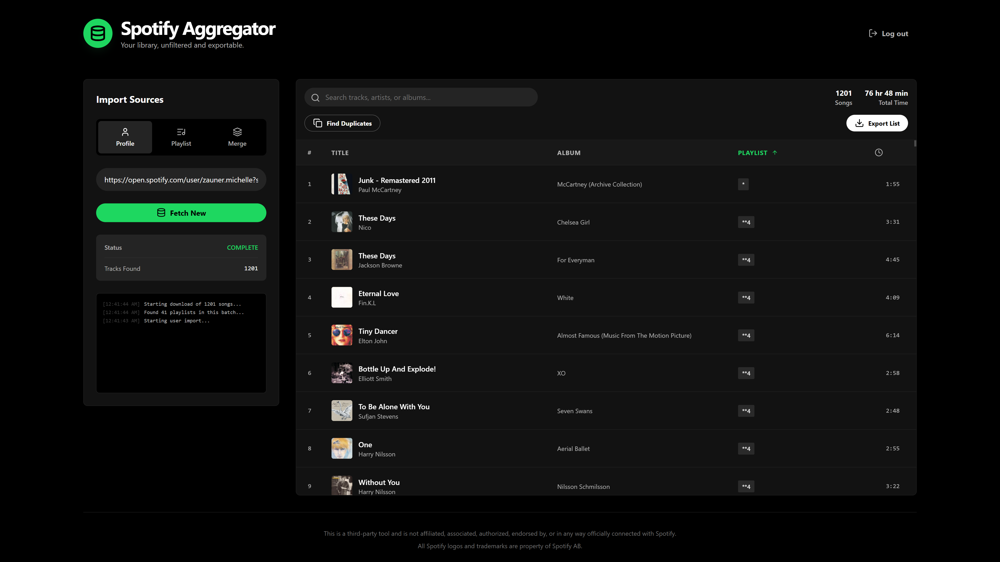
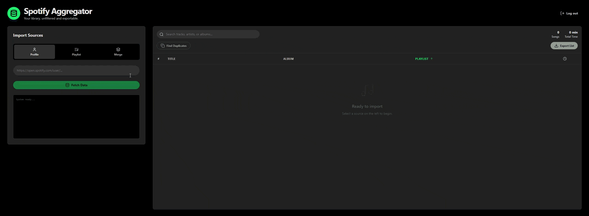
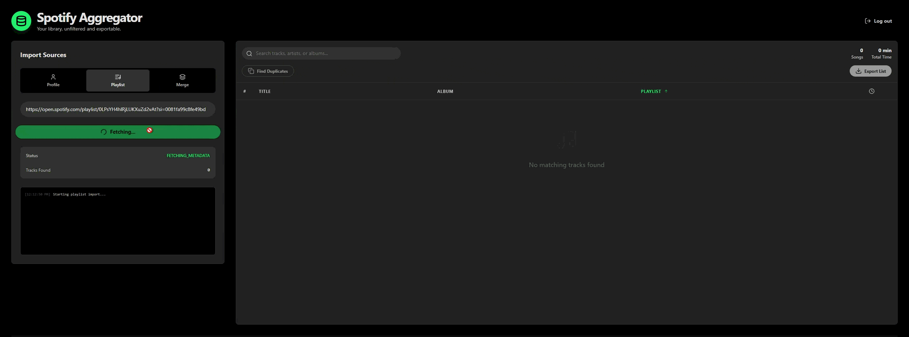

# [Spotify Aggregator](https://coleswinford.github.io/spotify-aggregator/)

A robust React application designed to aggregate, filter, sort, and export Spotify playlists. This tool allows users to fetch tracks from public user profiles, individual playlists, or merge multiple sources into a single, deduplicated dataset exportable to CSV.

**Note:** Unfortunately, Spotify does not provide access to extended use API for individuals anymore; therefore, the only way to access this application is by being manually registered as one of 25 maximum accounts whitelisted. You are welcome to self host.

## Features

* **Multi-Source Import:** Fetch tracks from a user profile, a playlist, or multiple specific playlists.
* **Deep Filtering:** Real-time search across Track Name, Artist, and Album.
* **Duplicate Detection:** Instantly identify and filter duplicate tracks across massive libraries.
* **Data Export:** Export your entire curated list to `.csv`. This could be an entire profile, one playlist, or playlists merged from many different profiles.
* **Audio Previews:** Native audio playback for track previews directly in the table (when supported by Spotify).
* **Performance:** Optimized and memoized components to handle large datasets (1000+ songs) without UI lag.

## Demo

### Profile

### Playlist

### Playlist Merge + Export

## Tech Stack

* **Frontend:** React + Vite
* **Styling:** Tailwind CSS
* **Icons:** Lucide React
* **Language:** JavaScript

## Disclaimer

This project is a third-party tool and is not affiliated, associated, authorized, endorsed by, or in any way officially connected with Spotify.
